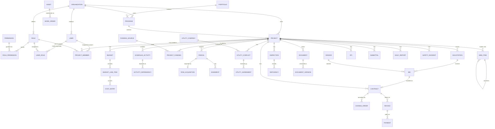

# ContextPro360 — DOT Capital Delivery Platform
## Requirements, RBAC & Database Design Analysis

Source: *Department of Transportation (DOT) Office of Capital Delivery — Work Breakdown Structure & ContextPro360 Platform Specification*

---

## 1. Overview

The uploaded document describes **ContextPro360**, an enterprise project-controls platform for a DOT Office of Capital Delivery. It combines:

- A **Work Breakdown Structure (WBS)** for capital projects (Initiation → Planning → Design → ROW → Utility Coordination → Environmental/Permitting → Procurement → Construction → CEI → Project Controls → Closeout).
- A **DOT organizational structure** (Commissioner → Deputy Commissioner, Capital Delivery → divisions).
- **~20 role-specific dashboards**, each listing KPIs, data fields, and features (Director, Program Controls Manager, Project Manager, Estimator, Scheduler, Traffic Engineer, Utility Coordinator, ROW, Inspector, Field Engineer, Superintendent, Contractor, Project Administrator, Finance, Legal Counsel, Safety Manager, Civil Engineer/Designer, Maintenance & Emergency, Procurement, Project Closeout, plus a public Customer Portal and an Academy/LMS).

This analysis distills that specification into implementable software requirements, a role/permission model, and a normalized PostgreSQL schema expressed as Prisma models.

---

## 2. Functional Requirements

Grouped by module; each is implementable as a set of API endpoints + dashboard views.

### FR-1 Identity, Tenancy & User Management
- FR-1.1 Support multiple organizations (agencies/contractors/consultants) as isolated tenants.
- FR-1.2 Self-service organization registration, user invitation, and onboarding wizard.
- FR-1.3 Role-based user registration (select a role from a fixed catalog at signup).
- FR-1.4 Org administrators manage users, departments, licenses, and permissions.
- FR-1.5 Subscription/billing tiers (Starter, Professional, Enterprise, Government) gate feature access.

### FR-2 Portfolio, Program & Project Management
- FR-2.1 Maintain a Portfolio → Program → Project hierarchy.
- FR-2.2 Each project has a WBS (hierarchical, matching the 11 top-level phases in the spec).
- FR-2.3 Track project status, phase, health (Green/Yellow/Red), and milestones.
- FR-2.4 Executive/Director/PCM roll-up dashboards aggregate metrics across the portfolio.

### FR-3 Program Controls (Cost, Schedule, Risk, EVM)
- FR-3.1 Budget management with categorized line items (Construction, Engineering, ROW, Utilities, Environmental, CEI, Contingency, ...).
- FR-3.2 Multi-source project funding (Federal/State/Local/Grants/Bonds) with authorized/obligated/expended tracking.
- FR-3.3 Change order lifecycle: draft → review → approval → execution, with cost/time impact.
- FR-3.4 Risk register (probability × impact scoring, mitigation plans, ownership).
- FR-3.5 Issue register with assignment, due dates, resolution tracking.
- FR-3.6 Schedule of activities with predecessor/successor dependencies, critical path, float, baseline vs. actual.
- FR-3.7 Earned Value Management: PV, EV, AC, CPI, SPI, EAC, FAC, VAC computed per project/program.
- FR-3.8 Two-week look-ahead/look-back reporting.

### FR-4 Engineering & Design
- FR-4.1 Track design packages by phase (Conceptual, 30/60/90/100%).
- FR-4.2 Drawing register with revisions, linked to versioned documents.
- FR-4.3 Design review comments with resolution tracking.
- FR-4.4 Constructability review and value-engineering logs.

### FR-5 Right-of-Way (ROW)
- FR-5.1 Parcel register (owner, area, status through the acquisition lifecycle).
- FR-5.2 Acquisition tracking: offers, negotiation, settlement, closing.
- FR-5.3 Easement and relocation (residential/business) tracking.
- FR-5.4 Condemnation case tracking (legal/court integration).
- FR-5.5 ROW certification checklist per project.

### FR-6 Utility Coordination
- FR-6.1 Utility company directory and per-project conflict register.
- FR-6.2 Conflict lifecycle: identified → investigation → design review → agreement → relocation → verified → closed.
- FR-6.3 Utility agreements with cost responsibility and execution dates.
- FR-6.4 Subsurface Utility Engineering (SUE) quality-level tracking.

### FR-7 Environmental & Permitting
- FR-7.1 Permit register by type/agency with status workflow.
- FR-7.2 Environmental commitments and compliance tracking (NEPA, stormwater, erosion control).

### FR-8 Procurement & Contract Administration
- FR-8.1 Vendor/contractor directory with DBE/MBE/WBE/SBE status and performance ratings.
- FR-8.2 Solicitation management (RFP/RFQ/IFB) with advertisement and closing dates.
- FR-8.3 Bid submission, evaluation, comparison, and award recommendation.
- FR-8.4 Contract lifecycle: draft → active → suspended/completed → closed, with change orders.
- FR-8.5 Invoicing, retainage, and payment tracking against contracts.

### FR-9 Construction Management & CEI
- FR-9.1 Daily construction/field reports (weather, crew, work performed, delays, photos).
- FR-9.2 Inspection scheduling and results by category (earthwork, drainage, utilities, asphalt, concrete, ...).
- FR-9.3 Deficiency/non-conformance tracking through correction and verification.
- FR-9.4 RFI and Submittal workflows with due dates and schedule/cost impact flags.
- FR-9.5 Punch list management through project closeout.
- FR-9.6 Materials testing (concrete, asphalt, soil) with pass/fail/retest status.

### FR-10 Safety Management
- FR-10.1 Incident/near-miss reporting with severity classification and root-cause tracking.
- FR-10.2 Hazard register and corrective-action tracking.
- FR-10.3 Toolbox talks and training/certification compliance.
- FR-10.4 Contractor safety scoring and rankings.

### FR-11 Finance
- FR-11.1 Enterprise budget vs. actual, cash flow, and forecasting.
- FR-11.2 Grants management with award/expenditure/compliance tracking.
- FR-11.3 Accounts payable/receivable with aging and approval workflows.
- FR-11.4 Payroll/labor cost tracking (certified payroll compliance).

### FR-12 Legal & Contract Compliance
- FR-12.1 Contract legal review workflow.
- FR-12.2 Claims and litigation case tracking.
- FR-12.3 Insurance/bond expiration monitoring.
- FR-12.4 Public records (FOIA) request tracking.

### FR-13 Asset Management & Maintenance
- FR-13.1 Post-construction asset registry (bridges, signals, pavement, drainage, lighting, sidewalks).
- FR-13.2 Preventive and corrective maintenance work orders.
- FR-13.3 Emergency incident response tracking.
- FR-13.4 Fleet/equipment and crew management.

### FR-14 Project Closeout
- FR-14.1 Closeout checklist (punch list, final inspection, financial reconciliation, document turnover, asset transfer, warranty).
- FR-14.2 Final payment and retainage release tracking.
- FR-14.3 Warranty period tracking with expiration alerts.
- FR-14.4 Lessons-learned capture and searchable knowledge base.

### FR-15 Document Control
- FR-15.1 Central document repository, categorized by type.
- FR-15.2 Full version history, approval workflow, e-signatures, audit trail on every document.

### FR-16 Reporting, GIS & AI
- FR-16.1 Generate role-specific standard reports (weekly/monthly/executive) on demand.
- FR-16.2 Interactive GIS mapping of projects, parcels, utilities, incidents, and assets.
- FR-16.3 AI-assisted features: predictive delay/overrun forecasting, auto-generated executive summaries, anomaly detection, document/photo analysis, natural-language query ("Ask the AI").

### FR-17 Notifications
- FR-17.1 Real-time, role-relevant alerts (budget thresholds, schedule slippage, expirations, approvals pending, incidents).

### FR-18 Customer Portal & Academy (public-facing / adjacent products)
- FR-18.1 Marketing site, plan comparison, self-service org/account registration, subscription billing.
- FR-18.2 Learning Management System: courses by role, quizzes, certifications, progress tracking, AI learning assistant.

---

## 3. Non-Functional Requirements

| # | Category | Requirement |
|---|---|---|
| NFR-1 | **Multi-tenancy** | Strict logical data isolation per `Organization`; no cross-tenant data leakage. |
| NFR-2 | **Security** | Encryption in transit (TLS 1.2+) and at rest; MFA support; SSO/SAML for government IdPs; secrets never in client code. |
| NFR-3 | **Authorization** | Fine-grained RBAC enforced server-side on every request, not just in the UI. |
| NFR-4 | **Auditability** | Immutable audit log for every create/update/delete/approve on regulated entities (contracts, change orders, payments, ROW, documents). |
| NFR-5 | **Availability** | 99.9% uptime target for core services; graceful degradation of AI/reporting features under load. |
| NFR-6 | **Performance** | Dashboard queries return in <2s at P95 for portfolios up to ~500 active projects. |
| NFR-7 | **Scalability** | Horizontally scalable API tier; read replicas for reporting/analytics workloads. |
| NFR-8 | **Mobile & Offline** | Field roles (Inspector, Field Engineer, Superintendent) need offline-capable mobile apps with sync-on-reconnect. |
| NFR-9 | **Integrations** | Primavera P6, Microsoft Project, GIS (Esri), BIM/CAD (Civil 3D, Revit, OpenRoads), e-signature providers. |
| NFR-10 | **Compliance** | GASB/GAAP (finance), FAR/state procurement law, OSHA, ADA, FHWA/AASHTO/MUTCD standards where applicable to data models (not enforced by software, but data must capture compliance artifacts). |
| NFR-11 | **Data Retention** | Configurable retention policies per document category; public-records-eligible content flagged. |
| NFR-12 | **Accessibility** | WCAG 2.1 AA for all web dashboards. |
| NFR-13 | **Extensibility** | New roles, permissions, and dashboard modules addable without schema migrations for core tables (permission catalog is data-driven). |

---

## 4. User Roles

Roles extracted from the DOT org chart and the 20 role-specific dashboards. Roles are split into **Organization-scoped** (apply platform/agency-wide) and **Project-scoped** (granted per project via assignment).

| Role | Scope | Typical Home Dashboard |
|---|---|---|
| System/Org Administrator | Organization | Administrator Dashboard (users, licenses, permissions) |
| Director (Capital Delivery / Engineering) | Organization | Director Executive Dashboard |
| Program Controls Manager (PCM) | Organization | PCM Executive Dashboard |
| Finance Manager / Accountant | Organization | Finance Dashboard |
| Legal Counsel | Organization | Legal Counsel Dashboard |
| Safety Manager | Organization | Safety Manager Dashboard |
| Project Manager | Project | Project Manager Dashboard |
| Assistant Project Manager | Project | Project Manager Dashboard (reduced permissions) |
| Project Administrator / Coordinator | Project | Project Administrator Dashboard |
| Estimator / Cost Engineer | Project | Estimator Dashboard |
| Scheduler / Planning Engineer | Project | Scheduler Dashboard |
| Civil Engineer / Designer | Project | Civil Engineer/Designer Dashboard |
| Traffic Engineer | Project | Traffic Engineer Dashboard |
| Utility Coordinator | Project | Utility Coordinator Dashboard |
| ROW Agent / Manager | Project | Right-of-Way Dashboard |
| Procurement Officer / Contract Administrator | Project or Org | Procurement Dashboard |
| Resident Engineer / Construction Manager | Project | Construction Dashboard |
| Inspector / CEI Inspector | Project | Inspector Dashboard (mobile) |
| Field Engineer | Project | Field Engineer Dashboard (mobile) |
| Superintendent | Project | Superintendent Dashboard (mobile) |
| Contractor (external user) | Project | Contractor Dashboard |
| Subcontractor (external user, restricted) | Project | Contractor Dashboard (scoped) |
| Maintenance / Asset Manager | Organization or Project | Maintenance & Emergency Dashboard |
| Customer Org Administrator (SaaS tenant admin) | Organization | Administrator Dashboard (Customer Portal) |
| Academy Learner | Organization | Learning Progress Dashboard |
| Public / Citizen (unauthenticated) | None (public) | Service Request submission only |

---

## 5. Responsibilities & Permissions per Role

Permission levels: **F**ull (create/edit/delete/approve), **E**dit (create/update, no delete/approve), **V**iew, **A**pprove-only, **—** none.

| Module → / Role ↓ | Program Controls | Design | ROW | Utility | Procurement | Construction/CEI | Safety | Finance | Legal | Documents |
|---|---|---|---|---|---|---|---|---|---|---|
| Director | V (all projects) | V | V | V | V | V | V | V | V | V |
| Program Controls Manager | **F** | V | V | V | V | V | V | V | — | E |
| Project Manager | E (own project) | E | E | E | E | **F** (own project) | E | V | V | **F** |
| Estimator | E (cost only) | V | — | — | E (bid analysis) | — | — | V | — | E |
| Scheduler | E (schedule only) | V | V | V | V | E (activity dates) | — | — | — | E |
| Civil Engineer/Designer | V | **F** | — | E (conflicts) | — | V | — | — | — | E |
| Traffic Engineer | V | E (traffic designs) | — | — | — | E (MOT review) | — | — | — | E |
| Utility Coordinator | V | E (conflict input) | E (utility-related) | **F** | — | E | — | — | — | E |
| ROW Agent/Manager | V | — | **F** | E (coordination) | — | — | — | V (ROW budget) | E (condemnation) | E |
| Procurement Officer | V | — | — | — | **F** | — | — | E (payments) | E (reviews) | E |
| Resident Engineer / Construction Manager | E | V | V | V | V | **F** | E | — | — | **F** |
| Inspector | — | — | — | — | — | E (inspections, deficiencies) | E (safety obs.) | — | — | E (photos, reports) |
| Field Engineer | — | V | — | E | — | E (daily reports, RFIs) | E | — | — | E |
| Superintendent | V (schedule) | — | — | E | — | **F** (field ops) | E | — | — | E |
| Contractor (external) | V (own contract) | V (own scope) | — | — | V (own bids/contract) | E (submissions only) | E (own crews) | V (own pay apps) | — | E (submissions) |
| Safety Manager | V | — | — | — | — | E | **F** | — | — | E |
| Finance Manager | V (financial) | — | V (ROW cost) | V | V (financial) | V | — | **F** | V | E |
| Legal Counsel | V | — | E (condemnation) | — | E (legal review) | V | — | V | **F** | E |
| Maintenance/Asset Manager | — | — | — | — | E (maint. procurement) | — | E | V | — | E |
| Org Administrator | — | — | — | — | — | — | — | — | — | — (manages users/roles/licenses instead) |

> This matrix is the seed data for `RolePermission`: each cell decomposes into concrete `Permission.key` rows (e.g. `procurement.contract.approve`, `rfi.create`, `document.version.upload`).

---

## 6. RBAC Model & Role Relationships

### 6.1 Why two levels of role assignment

DOT capital projects are matrixed: the same person is a **Project Manager on Project A** and merely a **Viewer on Project B**, while org-wide roles like Director, Finance Manager, or Legal Counsel need visibility into *every* project without being added to each one individually. A single flat `user.role` field cannot express this. The model therefore has two assignment paths that both resolve into the same permission-checking pipeline:

1. **`UserRole`** (Organization-scoped) — roles such as Director, Program Controls Manager, Finance Manager, Legal Counsel, Safety Manager, Org Administrator. Granting one of these gives visibility/authority across all projects in the organization.
2. **`ProjectMember`** (Project-scoped) — roles such as Project Manager, Inspector, Estimator, Contractor. A user can hold **different roles on different projects** (the same `Role` row, e.g. "Inspector," can be attached to many `ProjectMember` rows for the same user across different projects — or a user could be "Project Manager" on one project and "Field Engineer" on another).

### 6.2 Relationship chain

```
Organization 1───* User
Organization 1───* Role  (role catalog can be org-customized, or shared system roles where organizationId is null)
Role         *───* Permission     (through RolePermission)
User         *───* Role           (through UserRole — organization-wide grants)
User         *───* Project        (through ProjectMember, which also carries the Role for that project)
Project      *───1 Organization
```

**Effective permission resolution** for "Can User U do Action A on Project P?":
1. Look up all `UserRole` rows for U → collect `RolePermission` → if A is granted at org scope, allow (Director/Finance/Legal-style access).
2. Look up `ProjectMember` rows where `userId = U` and `projectId = P` → collect the `Role`'s `RolePermission` set → if A is granted, allow.
3. Otherwise deny.

This is a standard **hybrid RBAC** pattern (global roles + resource-scoped roles) and matches how the spec's dashboards behave: Directors/PCM/Finance/Legal see cross-project executive dashboards, while Project Managers, Inspectors, Estimators, etc. only see the projects they are assigned to.

### 6.3 Why `Role` and `Permission` are separate, many-to-many tables

- `Permission` is a fine-grained, stable catalog (`schedule.activity.update`, `contract.approve`, `document.delete`, ...) mapped straight onto the "Quick Actions"/CRUD verbs described per dashboard.
- `Role` is a human-meaningful bundle of permissions that an org administrator can inspect, clone, and customize (e.g., an agency might want a custom "Assistant Resident Engineer" role with a subset of Resident Engineer's permissions) without touching application code.
- Keeping them many-to-many (`RolePermission`) means new permissions can be added to a role at runtime (data change), not by deploying new code.

---

## 7. Database Relationship Design (PostgreSQL)

### 7.1 Design principles
- **UUID primary keys** everywhere (safe for distributed inserts, hides row-count/sequence information from a public API).
- **Every tenant-owned table traces back to `Organization`**, directly or transitively through `Project`, enforcing logical multi-tenancy; a `WHERE organization_id = :tenant` (or a join to `projects.organization_id`) guard belongs in every query/row-level-security policy.
- **Soft workflow states as enums** (`ProjectStatus`, `ContractStatus`, `RfiStatus`, etc.) rather than free-text, matching the fixed status vocab used throughout every dashboard in the source spec ("Draft / Submitted / Under Review / Approved / ...").
- **Money as `DECIMAL(14,2)`**, never float, for budgets/costs/contracts/payments.
- **Append-only `AuditLog`** with a polymorphic `(entityType, entityId)` pointer rather than a separate audit table per entity — the spec calls for "Audit Trail" under nearly every module (Document Control, Legal, ROW, Finance, Procurement), so one generic mechanism is more maintainable than a dozen bespoke ones.

### 7.2 Relationship inventory & rationale

| Relationship | Cardinality | Why |
|---|---|---|
| Organization → User | 1:N | An org has many users; a user belongs to exactly one org (simplifies multi-tenant isolation; consultants working across agencies get separate accounts per org). |
| Organization → Project (direct) / Organization → Program → Project | 1:N | Matches Portfolio → Program → Project rollups repeated in every executive dashboard. |
| Role ↔ Permission | **M:N** (`RolePermission`) | A permission (e.g. `document.delete`) is reused by many roles; a role bundles many permissions. Classic RBAC join table. |
| User ↔ Role | **M:N** (`UserRole`) | A user can hold multiple org-wide roles (e.g., Finance Manager *and* Legal Counsel in a small agency); a role is held by many users. |
| User ↔ Project (with Role) | **M:N with attribute** (`ProjectMember`) | Same user, different role per project — the join table itself carries `roleId`, making it a ternary relationship (User × Project × Role). |
| Project → WbsItem | 1:N, **self-referential** (`parentId`) | WBS is a tree (1.0 → 1.1 → 1.1.1); a recursive FK models arbitrary depth without a fixed number of level columns. |
| Project → Budget → BudgetLineItem → CostEntry | 1:N chain | Mirrors "Original Budget → Category → Actual Cost Entries" drill-down used in every Cost Management dashboard. |
| Project ↔ FundingSource | **M:N with attribute** (`ProjectFunding`) | A project draws on several funding sources (Federal + State + Local) and a funding source (e.g., a bond program) backs many projects; the join carries authorized/obligated/expended amounts per pairing. |
| ScheduleActivity ↔ ScheduleActivity | **M:N self-relation** (`ActivityDependency`) | Critical-path scheduling requires arbitrary predecessor/successor links (FS/SS/FF/SF), which is inherently many-to-many on the same entity. |
| Project → Parcel → RowAcquisition | 1:N then **1:1** | Many parcels per project; each parcel has at most one *active* acquisition record. Split into a separate table because acquisition has its own financial/negotiation lifecycle distinct from parcel identity — keeps `Parcel` lean for the common case (most reads just need status/owner). |
| Contract ↔ Bid | **1:1** (`Contract.awardedBidId` unique) | Exactly one winning bid becomes a contract; enforced with a unique FK rather than embedding contract fields on `Bid` (a bid can exist and never be awarded). |
| Solicitation → Bid → Vendor | 1:N / N:1 | Many vendors bid on one solicitation; a vendor bids on many solicitations over time — resolved as two separate 1:N edges rather than M:N because each `Bid` is a distinct, dated submission with its own amount/status, not a symmetric pairing. |
| Contract → Invoice → Payment | 1:N chain | A contract accumulates many invoices; an invoice can be paid in installments (retainage release, partial payment). |
| Document → DocumentVersion | 1:N | Every module in the spec calls for "Version Control" — one document, many immutable versions. |
| Inspection → Deficiency | 1:N | One inspection can surface multiple deficiencies, each independently tracked to closure. |
| Asset → WorkOrder | 1:N | One asset accumulates many maintenance work orders over its service life. |
| User → AuditLog / Notification | 1:N | Standard actor/recipient trails. |

### 7.3 Entity-Relationship Diagram (Mermaid)



*(This ER diagram intentionally omits low-cardinality lookup tables like `Milestone`, `Risk`, `Issue`, `Permit`, `PropertyOwner`, `ReviewComment`, `Notification`, and `AuditLog` for readability — each is a simple 1:N child of `Project` or `User` as documented in §7.2.)*

---

## 8. Prisma Schema

The full schema is provided as a separate file: **`schema.prisma`**.

Key structural choices carried into the Prisma file:
- `RoleScope` enum (`ORGANIZATION` / `PROJECT`) tags each `Role` so the application layer knows which assignment table (`UserRole` vs. `ProjectMember`) is valid for it.
- Composite unique constraints (`@@unique`) enforce natural keys the business already relies on: one `projectNumber` per org, one `activityCode` per project, one `contractNumber` per project, one `(userId, roleId)` grant, one `(projectId, userId, roleId)` membership, etc. — these double as the indexes most dashboard queries will filter on.
- All monetary fields use `Decimal` with explicit precision/scale.
- All workflow fields use Prisma enums matching the exact status vocabularies quoted in the source document, so UI dropdowns and the database stay in lockstep.

---

## 9. Authentication & Authorization Recommendations

### 9.1 Authentication
1. **Credential storage:** bcrypt/argon2-hashed passwords (`User.passwordHash`); never store plaintext.
2. **Session strategy:** short-lived JWT access tokens (5–15 min) + rotating refresh tokens stored as httpOnly, secure, SameSite=Strict cookies — avoids storing bearer tokens in localStorage (XSS-exposed), which matters given the platform handles contract, legal, and financial data.
3. **MFA:** TOTP-based MFA (`User.mfaEnabled`), required for Finance, Legal, Procurement, and Administrator roles at minimum; recommended for all roles.
4. **SSO/SAML/OIDC:** government agencies will require integration with an existing IdP (Azure AD/Entra ID, Okta, or a state SSO); design the auth layer around an OIDC broker from day one rather than bolting it on later.
5. **External users (Contractors/Subcontractors/Vendors):** separate, more restricted onboarding flow — invited by a Project Manager/Procurement Officer rather than self-registering, and scoped automatically to `ProjectMember` rows only (no org-wide `UserRole`).

### 9.2 Authorization
1. **Enforce permissions server-side**, on every API resolver/controller — never trust a hidden UI element as the only gate. The `RolePermission` table is the single source of truth; UI conditionally renders based on the *same* permission list returned by the API, not a separate hardcoded map.
2. **Centralize the check** in one policy/middleware layer (e.g., a CASL-style `can(user, action, subject, project?)` function, or Prisma middleware that injects `WHERE` clauses) rather than scattering `if (role === 'PM')` checks across route handlers — this is what keeps the 25+ roles in this spec maintainable.
3. **Row-level tenant isolation:** enforce `organization_id` scoping via PostgreSQL Row-Level Security (RLS) policies as a defense-in-depth layer beneath the application-level checks — a bug in application code then cannot leak cross-tenant rows.
4. **Project-level scoping:** for project-scoped roles, every query for project-owned tables (activities, RFIs, inspections, etc.) should join through `ProjectMember` to confirm the requesting user is assigned to that project, in addition to the permission check.
5. **Field-level restrictions** where the spec implies them (e.g., a Contractor should see their own contract's financials but not another contractor's, or the project's full budget) — implement as query-level filters (`WHERE vendorId = currentUser.vendorId`), not as UI hiding.
6. **Audit every privileged action** (approvals, deletions, payment releases, contract execution) into `AuditLog`, including the before/after diff in the `changes` JSON column.
7. **Permission seeding:** ship a seed script that creates the standard `Permission` catalog and the ~25 standard `Role` rows (as system roles, `organizationId = null`) from the matrix in §5, which each new organization can clone and customize.
8. **Rate limiting & anomaly detection:** especially for the public Customer Portal registration/login endpoints and any AI "Ask the AI" query endpoints that touch project data.

---

## 10. Summary

| Deliverable | Where |
|---|---|
| Functional & non-functional requirements | §2–3 above |
| User roles | §4 |
| Responsibilities/permissions per role | §5 |
| RBAC relationships | §6 |
| Database relationship design | §7 |
| Prisma schema | `schema.prisma` (separate file) |
| Relationship explanations (1:1 / 1:N / M:N) | §7.2 |
| ER diagram | §7.3 (Mermaid) |
| Auth/authz recommendations | §9 |

This gives you a working starting schema you can `prisma migrate dev` against PostgreSQL, plus the seed data shape (`Permission`, `Role`, `RolePermission`) needed to bootstrap RBAC before building out the ~20 role dashboards described in the source document.
